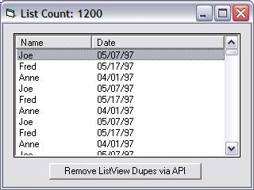



## Fast ListView DeDuper / String Search \(finally\!\)

### Description

I searched all over Google and PSC, there isn't a "straight to the point" listview deduper using API. Using VB6 is EXTREMELY slow, and using the built in listview FindItem() function is horrible in performance. API was the solution for me but there is few resources out there for listviews and deduping with api so I took this one upon my self and wanted to share it. It's my hope also that maybe we can get it to go faster... NOTE: This will only dedupe a listview based on the Primary column, it will not work for deduping the subitems unless you modify the code. Enjoy.

UPDATE: Added a faster method using a collection (credit to Steppenwolfe)
 
### More Info
 
Duplicate items in a listview

No duplicates in a listview

             |
---                |---
**Submitted On**   |2006-05-22 02:47:36
**By**             |[Michael L\. Canejo](https://github.com/Planet-Source-Code/PSCIndex/blob/master/ByAuthor/michael-l-canejo.md)
**Level**          |Intermediate
**User Rating**    |5.0 (10 globes from 2 users)
**Compatibility**  |VB 5\.0, VB 6\.0
**Category**       |[VB function enhancement](https://github.com/Planet-Source-Code/PSCIndex/blob/master/ByCategory/vb-function-enhancement__1-25.md)
**World**          |[Visual Basic](https://github.com/Planet-Source-Code/PSCIndex/blob/master/ByWorld/visual-basic.md)
**Archive File**   |[Fast\_ListV1996125222006\.zip](https://github.com/Planet-Source-Code/michael-l-canejo-fast-listview-deduper-string-search-finally__1-65422/archive/master.zip)

